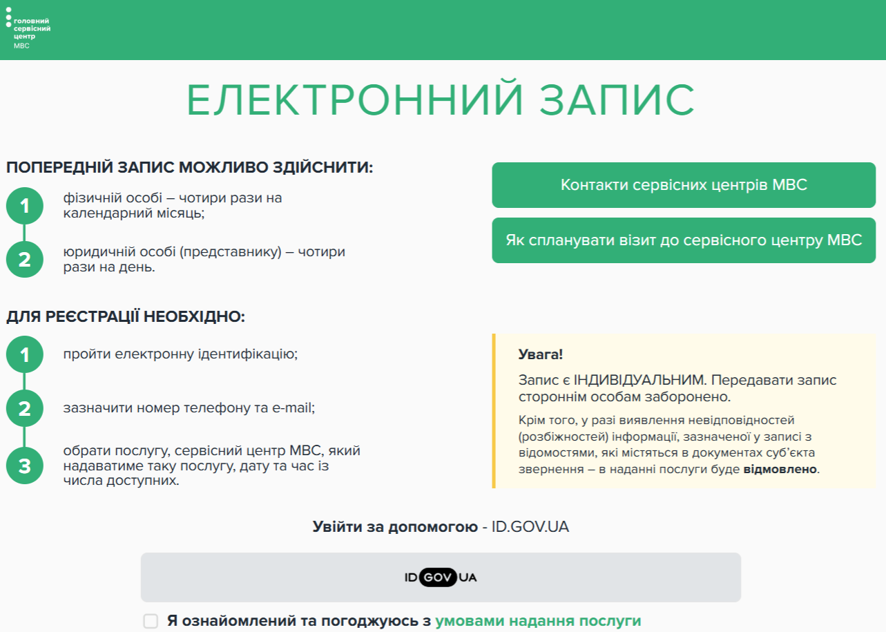

# driving-exam-slots-searcher

A simple application that automatically checks the availability of slots in the electronic order https://eqn.hsc.gov.ua/
for driving exams in Ukraine

   

## Motivation

It was difficult to constantly monitor the availability of slots for the practical exam, so I automated the process a
little, which ultimately helped my close person find an available slot and successfully pass the driving test.

## Description

Exam slots can appear randomly at any time on any date. The Chrome browser and the go-rod library are used to automate
this process. Notifications are sent to the phone in the Ntfy application. After receiving a notification with
information about the date and location of the exam, you need to manually book the slot.

## How to use

1. Compile the code for your operating system. You need to interact with the browser, so it's difficult to containerize
   this application. A Dockerfile in the project will help to create an executable file.

   *For Windows and Linux*
    - `docker build -t driving-exam-slots-searcher .` - build the image
    - `docker create --name temp-container driving-exam-slots-searcher` - create container
    - `docker cp temp-container:/exam-slots-searcher .` - copy the files. Change `.` to specify another place for
      executable files
    - `docker rm temp-container` - remove the container
2. Set up the search configuration using the `config.yaml` file:
    - Specify the desired dates to search for slots in the `exam_dates` field. Since slots are only available 21 days
      ahead, it is sufficient to use only a number. Separate the selected dates with `;` (“13;14;15”). Note that some
      dates do not have slots as they are weekends in the service.
    - Specify the desired slots in the `addresses` field. For Kyiv, use more precise addresses like
      "м. Київ, вул. Павла Усенка 8" because there are several centers. For cities with a single center, only the city
      name can be used ("м. Бровари"). Separate the locations with `;`. ("м. Київ, вул. Павла Усенка 8; м. Чернігів").

   **IMPORTANT:** the locations should be written exactly as on the exam location selection page, without any mistakes.
   
4. Specify a topic for the Ntfy application in the `ntfy_topic` field. The title should be unique and complex.
5. Download the Ntfy app on your smartphone and add the specified topic. Check the link for more
   information: https://docs.ntfy.sh/.
6. Run the program. The program will open a browser window where you will need to authenticate. After authorization, the
   window will be closed, and the search will be performed in headless browsers.

**IMPORTANT** to be able to take the practical exam, you must have successfully completed the theoretical exam
beforehand. Check manually if you have access to the practical exam by simply clicking on the `Практичний іспит` button
on the site https://eqn.hsc.gov.ua/cabinet/queue.

**MORE IMPORTANT** the exam must be booked manually. The app only sends notifications of availability. It does not
bypass captcha and does not book slots.

## Limitations

Unfortunately, the service center's website does not have a refresh token. The existing access token has a TTL of about
2 hours. After this time, you will be notified about reauthorization.
